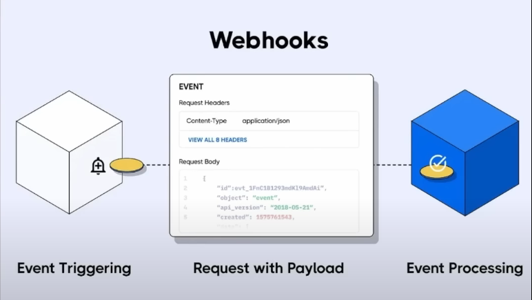

# About

- This project is aimed at solving a real world problem of community based earning and event management via online platform.
- Deployed Link: https://www.tumble-harshil.shop/
- Techstack

  - Nextjs, Typescript
  - Clerk Auth, Google OAuth
  - MongoDB, Stripe Payment, Uploadthings

- Hosting : GoDaddy.com
- Deployment service: vercel
- few commits have been made for vercel testing and hence higher volume of commits have been made.

# WebHooks

- I have used webhooks to create the user into mongodb as soon as he signs in via Clerk Auth

- 
